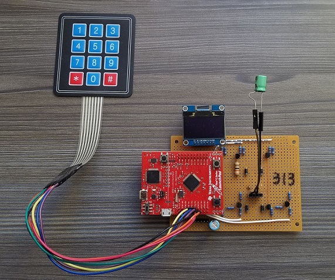

# LCR_Meter
  
IDE: Code Composer Studio 8.3.0  
Microcontroller: TI TM4C123GH6PM  
  
A low-cost LCR measurement device  
This is a class project in Embedded Microcontrollers class in Fall 2018.  
  
The device measure inductance, capacitance, and resistance by either selecting each measurement mode or auto mode.  
  
The measured values are displayed on the OLED display and also send the data to PC to display on Tera Term CMD shell.  
  
The 4 modes can be chosen by the mini keypad or PC through Tera Term CMD shell if the device is connected with PC through USB.  

